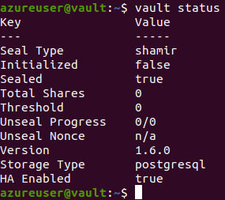

# Vault

Hashicorp Vault (https://www.vaultproject.io/) is a tool to hold all the organization secrets

It holds both key-value secrets and also rotates secrets, generating them dinamycally when our apps need them

## Before starting

1. Make a global find for "MY_VAULT_URL_HERE" and replace them according to your environment
2. Take a close look at the command <code>ansible-playbook</code> on files <code>sample_packer_config.json</code> and <code>sample_Vagrantfile</code> and replace the database connection data with your environment's.
3. If you want to activate TLS (HTTPS) for this server, take a look at the three files used on <code>sample_packer_config.json</code> and <code>sample_Vagrantfile</code> as well.

## Redeploying a new Vault server

After creating a new VM using your new image on Azure (check Packer section), you might have to go over the following instructions (SSHing into the machine):

1. <code>sudo service vault stop</code>
2. <code>sudo lsof -i -P -n | grep LISTEN</code> << this will help to see if vault was stuck in the port 8200. If so, run <code>sudo kill \<PID\></code>
3. <code>sudo echo export VAULT_ADDR=https://MY_VAULT_URL_HERE:8200 >> ~/.bashrc</code>
4. <code>sudo service vault restart</code>
5. If you are sshing into the VM, leave it and login again to the ~/.bashrc file can be loaded into the terminal
6. Your ultimate test is running <code>vault status</code> and an output simmilar to this one must be shown:

7. Then use <code>vault operator init</code> to init the server (this step might not be needed (will throw an error) if you are redeploying a server behind a database that was already in use)
8. Grab the generated unseal keys and the root token
9. Now use the command <code>vault operator unseal</code> for three times and past three different unseal keys that you got from step 7
10. You're done! Now you should be able to access https://MY_VAULT_URL_HERE:8200. Go back to your machine and have fun

## Other tools - how this repository works

### Packer

Packer is a tool to create an image (VM on Azure OR AMI on AWS)

Running packer:
1. Check the sample_packer_config.json file and change the name to packer_config. You will need the database password to put in it.
2. <code>packer build -var 'client_id=<client_id>' -var 'client_secret=<client_secret>' -var 'subscription_id=<subscription_id>' -var 'tenant_id=<tenant_id>' packer_config.json</code>

Checkout the file <code>packer_config.json</code> to see how packer will create your SO image and Azure instructions for it

### Ansible

Ansible is a tool to configure our OS as we want it to be.

You can run ansible with: <code>ansible playbook site.yml</code>. See examples at <code>sample_Vagrantfile</code> and <code>sample_packer_config.json</code>

The main file for this folder is <code>ansible_config/site.yml</code>. This file calls all the roles in "roles" folder

#### Ansible roles:

The roles folder has the Ansible configuration for:
1. Role - Install Vault 1.6.0

### Vagrant - build your Vault image locally

#### Vagrant commands:

- Have vagrant installed (like sudo apt install vagrant) and Oracle's VirtualBox

- How to run: navigate to root of this repo and run <code>sudo vagrant up</code>

This will create a virtual machine and will install everything listed on the Vagrantfile

- How to SSH into the created machine: run <code>sudo vagrant ssh</code>

- How to destroy the VM: run <code>sudo vagrant destroy</code>

## Redeploying Vault - activating TLS (https) and SSO afterwards

Once you need to change configurations and deploy a new Jenkins instance, you should:

1. Test your configurations manually. Once everything is set
2. Apply your configurations the same way you did manually but now using Ansible and its roles
3. Test it locally using Vagrant. Once everything is set
4. Use packer to build your new image at Azure
5. Create a new VM pointing to your external IP</code>